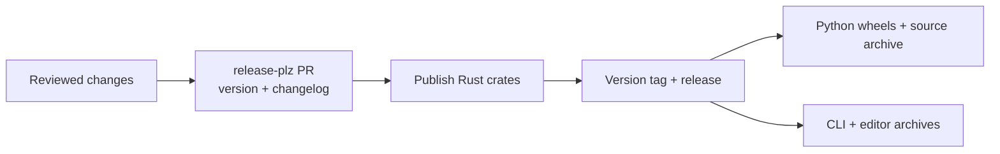

# Releases

Bloq releases the Rust workspace, Python package, and application binaries
from one shared version. Website publication is separate; see
[Website maintenance](site-maintenance.md).

## Release flow



:::{important}
GitHub Actions publication is disabled by default. Registry and binary publishing
jobs require `RELEASE_PUBLISH_ENABLED=true`. Keep it unset or false while preparing
a release or publishing manually. This variable does not gate local CLI uploads.
:::

See [website maintenance](site-maintenance.md) for documentation checks and
reviewable site artifacts. The [PyPI workflow](../.github/workflows/pypi.yml) builds all
three platform wheels and the source archive on tags, manual dispatches, and
PRs affecting core Rust code or packaging inputs. Editor-only, test-only, and
other documentation changes avoid release packaging. Superseded PR builds are
cancelled; publishing remains serialized and uncancelled. Installed archive
smoke tests verify packaging that checkout-based tests cannot cover.
Binary release builds use the checked-in Cargo lockfile. Security audits cover
dependency PRs, dependency changes on `main`, and new advisories each week.

## Names and versions

| Distribution | Name |
| --- | --- |
| Rust library | `bloq` |
| Rust CLI package / executable | `bloq-cli` / `bloq` |
| Desktop editor package / executable | `bloq_editor` |
| Python distribution / import | `bloq-py` / `bloq` |

All packages inherit `workspace.package.version`; internal Rust dependencies
use exact versions. Maturin reads that same version for Python. Release-plz
updates the version and internal requirements together. Routine publication
requires a merged release PR; the first publication uses the explicit bootstrap
procedure below. `bloq_py`, `bloq_test`, and `xtask` are not published
to crates.io.

Python-only changes ship with the next workspace release. For an earlier
Python release, prepare a reviewed `release-plz-` branch that updates the shared
version, exact internal requirements, lockfile, and changelog together. Do not
set a separate Python version or replace inherited Cargo versions.

## Stable release versions

The first stable release is `0.1.0`, tagged `v0.1.0`. Prepare subsequent stable
versions in reviewed release PRs.

| Surface | Current release |
| --- | --- |
| Cargo manifests and exact internal dependencies | `0.1.1` |
| Git tag and GitHub release | `v0.1.1` |
| Python wheel and source archive metadata | `0.1.1` |
| `bloq.__version__` and CLI version | `0.1.1` |

Maturin converts SemVer into Python's version spelling automatically. Keep the
shared Cargo version as the source of truth. Review release-plz's version and
changelog PR before merging. Update the shared version, all exact internal
requirements, and both Cargo lockfiles together.

Python environments, local artifact builds, and PyPI uploads use uv. Maturin
remains the Rust build backend; its CI action supplies the manylinux wheel build.

`git_release_type = "auto"` creates a stable GitHub release for `0.1.1`.
`git_release_latest = true` makes it GitHub's Latest release. Version-specific
binary links use `/releases/download/v0.1.1/`; links to the current stable
binaries can use `/releases/latest/download/`.

## Configure the registries before the first upload

### crates.io account and credentials

Sign in to [crates.io](https://crates.io/) using the `inmzhang` GitHub account and
verify the account email. Confirm ownership of every existing `bloq_*` placeholder
and `bloq`. Check `bloq-cli` availability again immediately before publication;
its registry name is distinct from Rust's `bloq_cli` library identifier.

Create an expiring API token with `publish-new` and `publish-update` permissions
for the workspace crates, including creating `bloq-cli`. A crate-specific token limited to existing crates
cannot create a new crate. Follow the [Cargo publishing guide](https://doc.rust-lang.org/cargo/reference/publishing.html)
and [crates.io token documentation](https://crates.io/docs/api-tokens).
The first publication of a new crate needs an API token; crates.io trusted
publishing is an option after the crate exists.

For Actions publication, create an environment named `crates-io` in the release
repository.
Store the registry token there as `CARGO_REGISTRY_TOKEN` using the hidden prompt:

```sh
gh secret set CARGO_REGISTRY_TOKEN --repo inmzhang/bloq --env crates-io
```

For release-plz, create a fine-grained GitHub PAT restricted to the release
repository with Contents read/write and Pull requests read/write. Allow
workflow-file write access if a release PR needs to modify a workflow. Store it as repository secret
`RELEASE_PLZ_TOKEN`, so both the release and release-PR jobs can access it:

```sh
gh secret set RELEASE_PLZ_TOKEN --repo inmzhang/bloq
```

A PAT-created tag/release triggers downstream workflows. Events created with
Actions' default `GITHUB_TOKEN` do not trigger the Python/binary workflows.
Set required reviewers on release environments if supported by the repository's
GitHub plan; publishing still requires the explicit variable opt-in.

### PyPI project and trusted publisher

The PyPI distribution is **`bloq-py`**, while the Python import and CLI remain
`bloq`. PyPI's `bloq` project belongs to an unrelated quantum SDK; do not install
both distributions in the same environment because their module/CLI names can
conflict. Confirm `bloq-py` availability again before upload; a missing public
project entry is not a reservation or guarantee that registration is allowed.

Create a [PyPI account](https://pypi.org/account/register/), verify its email, and
enable two-factor authentication. For local uploads, use the token setup in
[Manual PyPI publication](#manual-pypi-publication); GitHub environments and
trusted publishers are not needed. For Actions publication, create an environment
named `pypi`. Configure a [Pending Trusted Publisher](https://docs.pypi.org/trusted-publishers/creating-a-project-through-oidc/)
in PyPI's account Publishing settings:

| Field | Value |
| --- | --- |
| PyPI project name | `bloq-py` |
| GitHub owner | `inmzhang` |
| GitHub repository | `bloq` |
| Workflow filename | `pypi.yml` |
| Environment | `pypi` |

Use the workflow filename, not the display name or full path. The first OIDC
upload creates the project. No PyPI API token is needed, and a pending publisher
does not reserve a project name. The workflow already grants `id-token: write`
only to the publisher job. After the first upload, check the project owners and
maintain its publisher under project settings.

TestPyPI is optional and has separate accounts, project names, and publishers.
The current PyPI workflow targets production; manual dispatch builds/tests only.
Do not use a production tag push as a test upload while publishing is enabled.

## Prepare and publish a release

The examples below target `0.1.1`; replace that version when preparing a later
release. The first-publication bootstrap applies only before a crate has been
published. Subsequent releases use a reviewed release PR.

Choose release-plz or [manual Cargo](#manual-cargo-publication) and
[uv uploads](#manual-pypi-publication). For the fully manual route, keep
`RELEASE_PUBLISH_ENABLED` false throughout; the build-only workflow still works.

Finish the checks below against the reviewed release commit. Dispatch the PyPI workflow
on `main` to build all supported wheels and rebuild the source archive without
uploading anything:

```sh
gh workflow run pypi.yml --repo inmzhang/bloq --ref main
gh run list --repo inmzhang/bloq --workflow pypi.yml
```

Review all three wheel jobs, the source-archive job, and downloaded artifacts.
Keep artifacts from the chosen commit separate from old local builds. Run the
full CI workflow and the website workflow with `publish=false` as well. Confirm
license copies, package contents, typing files, dependency resolution, and the
exact `0.1.1` version in artifact metadata.

### Release-plz publication

Routine release-plz publication has `release_always=false`, which requires a
merged PR from a branch starting `release-plz-`. For a first publication
without a merged release PR, use a temporary local config to opt in explicitly
without permanently relaxing the release gate:

```sh
mkdir -p target
python3 - <<'PYTHON'
from pathlib import Path
config = Path("release-plz.toml").read_text()
assert config.count("release_always = false") == 1
Path("target/first-release.toml").write_text(
    config.replace("release_always = false", "release_always = true", 1)
)
PYTHON
release-plz release --config target/first-release.toml --repo-url https://github.com/inmzhang/bloq --dry-run
```

Run this from the release checkout. Supply `GIT_TOKEN` (the GitHub PAT) and
`CARGO_REGISTRY_TOKEN` privately in the process environment; the direct CLI uses
`GIT_TOKEN`, whereas the release-plz Action uses `GITHUB_TOKEN`. Never put tokens
in command arguments, checked-in files, or release notes.

A dry run cannot always verify unpublished sibling versions against crates.io.
Do not work around unresolved siblings by removing exact requirements or skipping
package verification. Confirm local locked checks and archive contents, then
publish in dependency order using release-plz or the manual order below.

**Publication is a separate maintainer action.** Review the release commit,
artifacts, and registry configuration before enabling downstream publication
and running the bootstrap command without `--dry-run`:

```sh
gh variable set RELEASE_PUBLISH_ENABLED --body true --repo inmzhang/bloq
release-plz release --config target/first-release.toml --repo-url https://github.com/inmzhang/bloq
```

The local release command publishes Rust packages and creates the tag/release;
it is a publication command even if the GitHub variable is false. The variable
gates Actions jobs, not commands run locally. The tag triggers the PyPI workflow;
the GitHub release triggers binary uploads. Confirm the release is marked
**Latest**, the tag points at the reviewed release commit, and all downstream uploads
finish before announcing it. If uploads fail, recover at the same commit/version.

### Manual Cargo publication

Authenticate locally with `cargo login` or privately supply
`CARGO_REGISTRY_TOKEN`; GitHub secrets are not needed for this route.

For CLI publication, use the following order, which also respects retained
versioned dev dependencies. Before each upload, run
`cargo publish -p NAME --dry-run --locked` after predecessors are available on
crates.io. Then publish that crate with
`--locked`, without `--allow-dirty` or `--no-verify`:

```sh
cargo publish -p bloq_utils --locked
cargo publish -p bloq_circuit --locked
cargo publish -p bloq_graph --locked
cargo publish -p bloq_ir --locked
cargo publish -p bloq_compile --locked
cargo publish -p bloq_stim --locked
cargo publish -p bloq-cli --locked
cargo publish -p bloq_editor --locked
cargo publish -p bloq_vm --locked
cargo publish -p bloq --locked
```

Wait for registry indexing between dependent uploads. Do not publish `bloq_py`,
`bloq_test`, or `xtask`. After all ten crates and the Python uploads below are
verified, create and push only the `v0.1.1` tag, then create the stable GitHub
release. Prepare reviewed notes in a local file and pass them with `--notes-file`:

```sh
mkdir -p target
cp CHANGELOG.md target/release-notes.md
git tag -a v0.1.1 -m "Bloq 0.1.1"
git push origin refs/tags/v0.1.1
gh release create v0.1.1 --repo inmzhang/bloq --verify-tag --latest --title "v0.1.1" --notes-file target/release-notes.md
```

Choose release-plz or the combined manual Cargo/PyPI route. Keep the tag fixed
once published.

### Manual PyPI publication

Use the build-only PyPI run prepared above. Confirm its `headSha` equals the
reviewed release commit, then download all four named artifacts from that one
run into a new directory. Replace `RUN_ID` in both the command and directory name:

```sh
gh run view RUN_ID --repo inmzhang/bloq --json headSha,status,conclusion
gh run download RUN_ID --repo inmzhang/bloq --name wheels-x86_64-unknown-linux-gnu --dir target/pypi-0.1.1-RUN_ID
gh run download RUN_ID --repo inmzhang/bloq --name wheels-aarch64-apple-darwin --dir target/pypi-0.1.1-RUN_ID
gh run download RUN_ID --repo inmzhang/bloq --name wheels-x86_64-pc-windows-msvc --dir target/pypi-0.1.1-RUN_ID
gh run download RUN_ID --repo inmzhang/bloq --name sdist --dir target/pypi-0.1.1-RUN_ID
```

Expect three `bloq_py-0.1.1-cp310-abi3-*.whl` files (manylinux x86_64,
macOS ARM64, Windows x86_64) and `bloq_py-0.1.1.tar.gz`. Inspect their metadata,
licenses, and contents; retain their SHA-256 hashes. Do not upload a mixed local
`target/wheels/` directory or the local `linux_x86_64` wheel.

For a new PyPI project, create an account-scoped API token. After the first
upload creates `bloq-py`, replace it with a project-scoped token. A pending
Trusted Publisher authenticates Actions, not a local terminal. Supply the token
through a password manager or a hidden Bash prompt; do not pass it in arguments:

```sh
read -r -s -p 'PyPI API token: ' UV_PUBLISH_TOKEN
printf '\n'
export UV_PUBLISH_TOKEN
uv publish --trusted-publishing never --publish-url https://upload.pypi.org/legacy/ \
  --check-url https://pypi.org/simple --dry-run \
  'target/pypi-0.1.1-RUN_ID/*.whl' 'target/pypi-0.1.1-RUN_ID/*.tar.gz'
```

The dry run does not upload files or prove registry authorization. After reviewing
it, upload those exact artifacts and clear the token from the shell:

```sh
uv publish --trusted-publishing never --publish-url https://upload.pypi.org/legacy/ \
  --check-url https://pypi.org/simple \
  'target/pypi-0.1.1-RUN_ID/*.whl' 'target/pypi-0.1.1-RUN_ID/*.tar.gz'
unset UV_PUBLISH_TOKEN
```

Keep the publishing variable false for this route. On a partial upload, retry
with the same files and `--check-url`; uv skips files already present with matching
hashes. PyPI filenames cannot be replaced, including after deletion. If an uploaded
artifact is wrong, stop and prepare a new version instead of rebuilding that filename.

## Check the release candidate

| Check | Evidence |
| --- | --- |
| `just ci` | Formatting, build variants, documentation, Rust and Python tests |
| `just test-full` | Release-mode coverage including ignored cases |
| Manual PyPI workflow | Installed wheels and source archive tested; no publication |
| Website artifact | Documentation and generated APIs agree with the candidate |
| Binary archives | Executables at archive root; target and package names agree |

```sh
just changelog     # preview unreleased notes
just py-build      # build a local wheel
just py-sdist      # build a local source archive
```

The Python workflow builds `abi3-py310` wheels for Linux x86_64 (manylinux),
macOS ARM64, and Windows x86_64. It tests installed wheels on Python 3.10,
including the `bloq` console script, and rebuilds the source archive separately.
A wheel should work without Cargo on PATH; a source build requires Rust. Local
`just py-build` wheels may have a native `linux_x86_64` tag that PyPI rejects.
Use the workflow's manylinux wheels for upload, rather than that local smoke-test
artifact.

CLI/editor archives cover Linux x86_64, macOS ARM64, and Windows x86_64. They
support GitHub downloads and cargo-binstall. The CLI metadata maps package
`bloq-cli` to archive `bloq-<target>`; keep that URL synchronized with the binary
workflow. Desktop binaries are unsigned, and Linux still needs system display
and audio libraries.

Editor releases also include desktop archives for macOS and Linux. macOS
archives contain **Bloq Editor.app**; Linux archives include a launcher, icon,
and `install.py` for user-local installation. Windows executables embed the app
icon. Build with `just editor-package` (Python 3.11+) and check the package layouts
with `just editor-package-check`. Bare binary archives remain available for
cargo-binstall.

Inspect package-local Apache-2.0 license copies, Python typing files, gallery
data, and command entry points. Include breaking API changes and Python-only
changes in the release notes.

Wheels and binary archives include `THIRD-PARTY-NOTICES.txt`; editor archives
also retain the bundled font licenses. Check the dependency notices before
building release artifacts:

```sh
cargo fetch --locked
uv run --no-project python tools/third_party_licenses.py --check
```

After changing dependencies, run the script without `--check` and review both
generated copies. It collects license files from the locked Cargo sources,
including vendored native libraries and fonts. Crates that omit those files use
version-specific upstream notices and declared license texts recorded in
`tools/third_party_licenses.json`; review that file when updating those crates.

## Publish subsequent stable releases

Configure the registry credentials and trusted publishers specified by the
workflows. Rust publication uses `CARGO_REGISTRY_TOKEN` and
`RELEASE_PLZ_TOKEN`; Python uses the configured PyPI trusted publisher. Check
registry ownership before enabling publication.

After reviewing checks and artifacts, enable `RELEASE_PUBLISH_ENABLED` and merge
the release PR. Do not create a tag as a substitute for publishing its Rust
package dependencies. The Python workflow verifies that the tag matches the
shared Cargo version.

## Verify uploads and install the release

Confirm all ten Rust packages list `0.1.1` under the expected owners,
PyPI lists `bloq-py==0.1.1` with all supported wheels and the source archive,
and the GitHub release contains CLI/editor archives and checksums. Verify
installation in a fresh environment, outside the source checkout:

```sh
uv venv --python 3.10 target/release-install
uv pip install --python target/release-install/bin/python --only-binary=:all: "bloq-py==0.1.1"
target/release-install/bin/python -c "import bloq; assert bloq.__version__ == '0.1.1'"
target/release-install/bin/bloq --version
target/release-install/bin/bloq compile --gallery cnot -d 3 --quiet -o target/release-install/cnot.stim
cargo install bloq-cli --version 0.1.1 --locked --root target/release-cargo-install
target/release-cargo-install/bin/bloq --version
```

The venv and executable paths above are for Linux/macOS; on Windows use
`Scripts/python.exe` and `Scripts/bloq.exe`. Users can add the Rust facade with
`cargo add bloq@=0.1.1`, and install the Python CLI with
`uv tool install "bloq-py==0.1.1"`. Explicit versions select the release without
accidentally installing a placeholder or an unrelated Python project.

Website publication is separate. Use `release_tag=v0.1.1` and `make_stable=true`
to build its retained documentation snapshot and stable alias. Review the website
artifact with `publish=false` before publishing it. Set
`RELEASE_PUBLISH_ENABLED=false` again if you want a manual hold until the next
release. That stops future Actions uploads; it does not undo
an upload or cancel one already running.

## Recover an interrupted release

Workspace publication is not atomic. Verify all published crates and downstream
workflows before announcing completion.

| Failure | Recovery |
| --- | --- |
| Registry rate limit or interrupted crate publication | Follow the registry retry guidance and rerun the failed job at the same commit |
| Python publication | Rerun failed jobs for the same tag |
| Missing CLI/editor assets | Run the Binaries workflow manually with the existing release tag |
| Future publication must stop | Set the publishing variable to false; this does not undo uploads or stop an already-running job |

Published versions are immutable. Do not bump versions or move/delete tags just
to retry an incomplete run. Keep the website's retained release snapshots intact.
